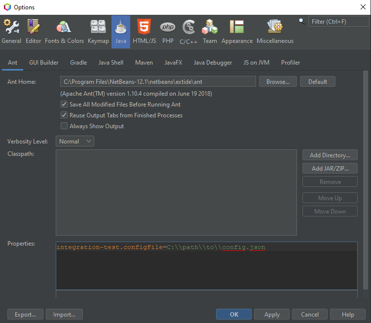
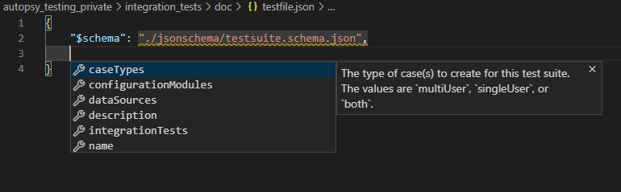

# Integration Testing Infrastructure

## What it does

This infrastructure does the following:
1. Creates a case for each test suite.
2. Updates the configuration to be used during ingest for this case.
3. Ingests specified data sources.
4. Exercise parts of Autopsy that generate output.
5. Serialize that output to a yaml file for that case.
6. Compare the yaml output to a gold file and generate a diff.  This step is optional, and is only run if a gold directory path and a diff file path are specified.


## <a name="setup"></a> Setup 

The integration testing requires a configuration for the environment with the following items:

|   |Type|Description|Required|
|---|----|-----------|--------|
|**rootTestOutputPath**|`string`|The path to where yaml file results will be outputted.| Yes|
|**rootTestSuitesPath**|`string`|The path to be scanned for json test suite files.| Yes|
|**rootCaseOutputPath**|`string`|The path to where autopsy cases for these test suites will be stored.| Yes|
|**workingDirectory**|`string`|If any of the above paths are relative paths, they will be relative to this path.| Yes|
|**diffOutputPath**|`string`|The path to where the diff file will be written (optional; if not specified, no diff'ing will happen).|No|
|**rootGoldPath**|`string`|The path to where the gold yaml files are stored (optional; if not specified, no diff'ing will happen).|No|
|**dbConnection**|`connectionconfig`|Database connection parameters.|No|
|**mqConnection**|`connectionconfig`|Active Mq connection parameters.|No|
|**solrConnection**|`connectionconfig`|Solr connection parameters.|No|
|**zkConnection**|`connectionconfig`|ZooKeeper connection parameters.|No|
|**crConnection**|`connectionconfig`|Central Repository connection parameters to be used with multi-user testing.|No|

For the `dbConnection`, `mqConnection`, and `solrConnection`, the `connectionconfig` includes the following fields:

|   |Type|Description|Required|
|---|----|-----------|--------|
|**hostName**|`string`|Domain of host.| Yes|
|**userName**|`string`|User name for the host if applicable.|No|
|**password**|`string`|Password to use with the host if applicable.|No|
|**port**|`integer`|Domain of host.|No|


These properties can also be configured via json config file.  If the `workingDirectory` is not specified in the json config file, the working directory will be the same as the parent directory of the config file.

An example of that config file would look like this:
```
{
    "diffOutputPath": ".\\diff.txt",
    "rootCaseOutputPath": ".\\case",
    "rootGoldPath": ".\\gold",
    "rootTestOutputPath": ".\\out",
    "rootTestSuitesPath": ".\\test_suites",
    "workingDirectory": "C:\\path\\to\\working\\dir",
    "dbConnection": {
        "userName": "db_username",
        "password": "password54321",
        "hostName": "127.0.0.1"
    },
    "mqConnection": {
        "userName": "mq_username",
        "password": "password54321",
        "hostName": "127.0.0.1"
    },
    "solrConnection": {
        "hostName": "127.0.0.1"
    },
    "zkConnection": {
        "hostName": "127.0.0.1"
    },
    "crConnection": {
        "hostName": "127.0.0.1",
        "userName": "cr_username",
        "password": "password54321"
    }
}
```

There are json schema files defining this configuration schema in [jsonschema/envconfig.schema.json](../jsonschema/envconfig.schema.json).  These schema files can simplify the creation of this configuration file.  See the [json schema](#json-schema) section for more information.

These values can also be provided directly as parameters.  See the notes concerning [command line parameters](#command-line-parameters) or [running from the command line](#running-from-the-command-line).

## IDE Configuration

In Netbeans, these parameters can be set up by going to `Tools` > `Options`.  From there, select the java tab and specify these parameters in the `Properties` field like so:



Code snippit:
```
integration-test.configFile=C:\\path\\to\\config.json
```

### Command Line Parameters

All of the properties in the configuration file can also be specified as parameters directly.  Nested properties in the json (i.e. `userName` for `dbConnection`) are separated by periods like so:

```
integration-test.dbConnection.userName=db_username
```

Here is a template for all the properties (this assumes default ports for the database, solr, and active mq):

```
integration-test.rootTestOutputPath=.\\out
integration-test.diffOutputPath=.\\diff.txt
integration-test.rootGoldPath=.\\gold
integration-test.workingDirectory=C:\\path\\to\\working\\dir
integration-test.rootTestSuitesPath=.\\test_suites
integration-test.rootCaseOutputPath=.\\case

integration-test.dbConnection.userName=db_username
integration-test.dbConnection.password=password54321
integration-test.dbConnection.hostName=127.0.0.1

integration-test.mqConnection.userName=mq_username
integration-test.mqConnection.password=mq_username
integration-test.mqConnection.hostName=127.0.0.1

integration-test.solrConnection.hostName=127.0.0.1

integration-test.zkConnection.hostName=127.0.0.1

integration-test.crConnection.hostName=127.0.0.1
integration-test.crConnection.userName=cr_username
integration-test.crConnection.password=password54321
```

However these properties are defined, the integration tests can be run by running the `integration-test` ant target or by right-clicking on `org.sleuthkit.autopsy.integrationtesting.TestRunner` and selecting `Test File` or `Debug Test File`.


## Running From the Command Line

The easiest way to run from the command line is something like this:

```
ant -f "C:\\path\\to\\autopsy\\Core" integration-test -Dintegration-test.configFile=C:\\path\\to\\config.json
```

or all of the parameters can be specified as well like this:

```
ant -f "C:\\path\\to\\autopsy\\Core" integration-test \
    -Dintegration-test.rootTestOutputPath=".\\out" \
    -Dintegration-test.diffOutputPath=".\\diff.txt" \
    -Dintegration-test.rootGoldPath=".\\gold" \
    -Dintegration-test.workingDirectory="C:\\path\\to\\working\\dir" \
    -Dintegration-test.rootTestSuitesPath=".\\test_suites" \
    -Dintegration-test.rootCaseOutputPath=".\\case" \
    -Dintegration-test.dbConnection.userName="db_username" \
    -Dintegration-test.dbConnection.password="password54321" \
    -Dintegration-test.dbConnection.hostName="127.0.0.1" \
    -Dintegration-test.mqConnection.userName="mq_username" \
    -Dintegration-test.mqConnection.password="mq_username" \
    -Dintegration-test.mqConnection.hostName="127.0.0.1" \
    -Dintegration-test.solrConnection.hostName="127.0.0.1" \
    -Dintegration-test.zkConnection.hostName="127.0.0.1" \
    -Dintegration-test.crConnection.hostName="127.0.0.1" \
    -Dintegration-test.crConnection.hostName="127.0.0.1" \
    -Dintegration-test.crConnection.hostName="127.0.0.1" \
    -Dintegration-test.crConnection.userName="cr_username" \
    -Dintegration-test.crConnection.password="password54321"
```

## Components

### Test Suite JSON Configuration

Test suites are defined in JSON files.  A JSON file may contain test suite objects whose schema is defined below or a file may contain an array of test suite objects.  The configured test suites directory is scanned for these test suite json files at run time.  Here is an example:

```
  {
    "name": "datasourcesummarytests",
    "description": "A case for ingestion and testing with datasource summary.",
    "dataSources": ["..\\Documents\\images\\xp-sp3-v4.E01"],
    "caseTypes": "singleUser",
    "configurationModules": [
      {
        "resource": "org.sleuthkit.autopsy.integrationtesting.IngestModuleSetupManager",
        "parameters": {
          "modules": [
            "org.sleuthkit.autopsy.recentactivity.RecentActivityExtracterModuleFactory"
          ]
        }
      }
    ],
    "integrationTests": {
      "excludeAllExcept": [
        "org.sleuthkit.autopsy.datasourcesummary.UserActivitySummaryTests"
      ]
    }
  }
  ```
#### Json Schema

There are json schema files located in `autopsy_testing_private/integration_tests/doc/jsonschema`.  VS Code as well as other editors provide autocomplete functionality for specified json schema.  [See this page for more information](https://code.visualstudio.com/docs/languages/json#_json-schemas-and-settings).  For example:



The [envconfig.schema.json](../jsonschema/envconfig.schema.json) schema file is for creating an environment configuration as described in the [Setup section](#setup) and the [testsuite.schema.json](../jsonschema/testsuite.schema.json) schema file is for creating a test suite described in the [Test Suite Schema section](#test-suite-schema).

#### Test Suite Schema

This is the schema for test suites to be defined in a json file.  

**Properties**

|   |Type|Description|Required|
|---|----|-----------|--------|
|**caseTypes**|`string`|The type of case(s) to create for this test suite.  The values are `multiUser`, `singleUser`, or `both`.|  Yes|
|**configurationModules**|`paramaterizedresource` `[]`|A list of any configuration modules to be run to properly setup the autopsy environment and create the correct ingest settings.|No|
|**dataSources**|`string` `[]`|A list of data source paths to be ingested for case(s) in the test suite.  If a relative path is used, the path must be relative to the working directory specified as a part of the `EnvConfig`.|  Yes|
|**description**|`string`|Provide an overview of what this test suite tests.|No|
|**integrationTests**|`integrationtest`|Configured which `IntegrationTestGroup` classes should be run.|  Yes|
|**name**|`string`|The name of this test suite.  The name is used along with the case type to determine the file name of the outputted yaml.|  Yes|  
      

#### `integrationtest` Schema

Configured which `IntegrationTestGroup` classes should be run.

**Properties**

|   |Type|Description|Required|
|---|----|-----------|--------|
|**excludeAllExcept**|`paramaterizedresource` `[]`|The canonical paths of `IntegrationTestGroup` outputting tests that should be run.  Parameters can be provided optionally.|No|
|**includeAllExcept**|`string` `[]`|The canonical paths of `IntegrationTestGroup` implementations to be specifically excluded.|No|


#### `parameterizedresource` Schema

The canonical path of a resource (i.e. org.sleuthkit.autopsy.datasourcesummary.UserActivitySummaryTests) and optionally, any parameters to be provided to the resource.

A `parameterizedresource` can either be a string with the canonical path to the resource or an object with the following properties:

|   |Type|Description|Required|
|---|----|-----------|--------|
|**resource**|`string`|The canonical path of a resource (i.e. org.sleuthkit.autopsy.datasourcesummary.UserActivitySummaryTests).| Yes|
|**parameters**|`object`|Parameters to be provided to the resource.  These parameters are deserialized into an object using jackson and provided as a single java parameter.|No|  


### `ConfigurationModule` Interface (Experimental)
***Warning: this design is still experimental and potentially in flux.***  

`ConfigurationModule` implementations aide in properly establishing the correct autopsy environment and ingest settings for an integration test.  Implementors of this class must have a public no-parameter constructor in order to be properly instantiated.

The `ConfigurationModule<T>` interface has two methods:
1.  **`IngestJobSettings configure(IngestJobSettings curSettings, T parameters)`**
   This method accepts arguments of type `T` which is a generic parameter for the class and the current state of ingest job settings.  It returns the updated ingest job settings.  For instance, a `CentralRepositoryConfigurationModule` could take the current templates in the current ingest job settings and add a template for Central Repository ingest.  It also potentially could tweak user settings (i.e. set up a path for a sqlite central repository)
2.  **`void revert()`**
   This method reverts any environmental configuration that occurred during the configure phase.  For instance, in the previous example, the central repository path could be reverted to its previous value.

***Note:*** *If no configuration modules are specified in a test suite configuration, current environment configuration with default ingest settings are used.*

### `TestGroup` Interface

Implementors of `TestGroup` provide means of outputting data after ingest for a test suite has occurred.  An implementation should be public, have `@ServiceProvider(service = IntegrationTestGroup.class)` as a class annotation, and the class should implement `IntegrationTestGroup` so that a test group can be discovered by netbeans.  An example would look like this:

```
import org.sleuthkit.autopsy.integrationtesting.IntegrationTestGroup;

@ServiceProvider(service = IntegrationTestGroup.class)
public class UserActivitySummaryTests implements IntegrationTestGroup {
   ...
}
```

The `IntegrationTestGroup` provides methods for setup and teardown that may be implemented:
- `void setupClass()`: called before any method in that `IntegrationTestGroup` implementation is called.
- `void tearDownClass()`: called after all methods in an `IntegrationTestGroup` are called.
- `void setup()`: called before each test in an `IntegrationTestGroup` is called.
- `void tearDown()`: called after each test in an `IntegrationTestGroup` is called.

### `@IntegrationTest` Methods
Methods within an `IntegrationTestGroup` may be prefixed with the `@IntegrationTest` annotation signifying that this method will be used to output data from the current test suite case.  An `@IntegrationTest` method should have the annotation, be public, and generate some result that can be serialized by SnakeYAML (i.e.List, Map, POJO with getters, or some combination of those items).  If that method throws an exception, the exception will be serialized.  Here is an example method declaration:

```
@IntegrationTest
public Map<String, List<TopDomainsResult>> getRecentDomainsTest() throws TskCoreException
```

The `TopDomainsResult` class is a simple java object with getters that looks like this:

```
public static class TopDomainsResult {
   private final String domain;
   private final Long visitTimes;
   private final Date lastVisit;

   ...constructor ommitted for brevity...

   public String getDomain() {
      return domain;
   }

   public Long getVisitTimes() {
      return visitTimes;
   }

   public Date getLastVisit() {
      return lastVisit;
   }
}
```

An `@IntegrationTest` method may also accept a single parameter whose values will be deserialized from the json test suite configuration.